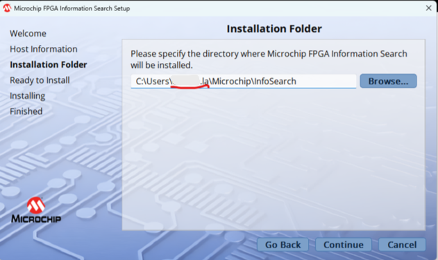
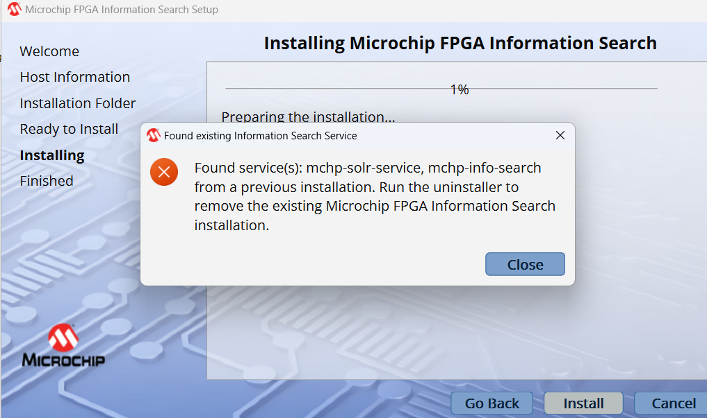
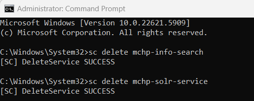

# Information Search

## **1. Overview**

**Information Search** is a specialized utility designed to streamline access to **FPGA documentation** on the **Microchip** website.

With **Information Search**, users can quickly locate:

* Datasheets
* Application notes
* Reference manuals
* Other technical resources

All results are sourced **directly from official Microchip FPGA web resources**.
This tool is ideal for **engineers**, **developers**, and **administrators** who require **fast, reliable access** to the latest FPGA documentation.

---

## **2. Features**

* **High-speed search** across all Microchip FPGA documentation
* **Filter by document type** (datasheet, application note, manual, etc.)
* **Customizable search parameters** for more targeted and efficient results

---

## **3. System Requirements**

| Requirement          | Details                                              |
| -------------------- | ---------------------------------------------------- |
| **Operating System** | Windows 10 / Windows 11                              |
| **Privileges**       | Local administrator rights required for installation |
| **Memory**           | Minimum 4 GB RAM                                     |
| **Disk Space**       | Minimum 1 GB free space                              |

---

## **4. Installation Instructions**

> **Important:** You **must** have *local administrator privileges* to install Information Search.
> If you do not have these privileges, please contact your IT department.

### **Windows Installation Steps**

1. **Download the installer** from one of the following locations:

   * Releases: [https://github.com/MicrochipTech/information-search/releases](https://github.com/MicrochipTech/information-search/releases)
2. **Right-click** the downloaded installer and select **“Run as administrator.”**
3. When prompted for an installation path:

   * **Do not install in the default “la” account directory**.
   * Choose or create a new **empty folder** for installation.
   * The installation directory **must be empty** before proceeding.

   **Example:**
   
4. Follow the **on-screen prompts** to complete the installation.

---

### **Removing a Previous Installation**

If you have previously installed the tool, please follow these instructions to remove it before installing a new version:

1. **Navigate** to the installation directory.
2. **Run** the file named `maintenancetool.exe` as administrator.
3. Follow the on-screen prompts to **uninstall** the existing version.
4. After the uninstall process completes, **reboot your machine** to remove any remaining directories.
5. Once your system restarts, you can **install the new version** following the steps above.

---

## **Troubleshooting Installation Conflict**

### **Problem**

When installing the latest version (e.g., `infosearch-2025.10.15.exe`), you may see this error:

> “Found services: mchp-solr-service, mchp-info-search from a previous installation. Run the uninstaller to remove the existing Microchip FPGA Information Search installation.”

This happens when old services remain registered after uninstalling.

**Example:**


---

### **Solution**

1. Open **Command Prompt as Administrator**.

2. Run the following commands to remove the leftover services:

   ```
   sc delete mchp-info-search
   sc delete mchp-solr-service
   ```

   Both should return:
   `[SC] DeleteService SUCCESS`

   **Example:**
   

3. Refresh the **Services** tab in **Task Manager** to confirm both entries are gone.

4. Reinstall the latest version from:
   [https://github.com/MicrochipTech/information-search](https://github.com/MicrochipTech/information-search)

After this, installation should complete successfully.

---

## **5. Important Download Notice**

When viewing the **GitHub release page**, you will see multiple files under the **Assets** section.

Please **download only the `.exe` file** - for example:

```
infosearch-2025.10.15.exe
```

Do **not** download the automatically generated files labeled:

* **Source code (zip)**
* **Source code (tar.gz)**

These are automatically created by GitHub and **do not contain the actual application or any source code**.

**Download this:**
`infosearch-<release-number>.exe`

**Ignore these:**
`Source code (zip)`
`Source code (tar.gz)`

---

## **6. Usage**

1. **Launch** your preferred web browser.
2. **Navigate** to:

   ```
   http://localhost:5002/
   ```

   or use the **hostname and port** specified during installation.
3. **Enter keywords** to search for FPGA documentation on the Microchip website.
4. **Filter** results by:

   * Document type
   * Product family
   * Other search parameters

---

## **7. Support & Documentation**

For troubleshooting and further assistance:

* Open the **Information Search** interface.
* Click **Help** on the **right-hand side** of the top banner to access the **User Guide**.

---

### **Contact**

For additional support or feedback, please reach out via your organization’s IT or Microchip technical support channel.

---